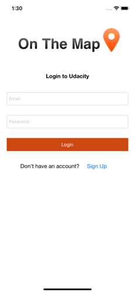
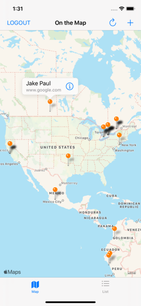
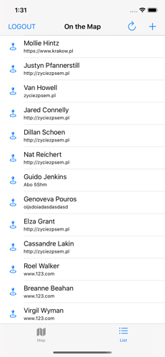
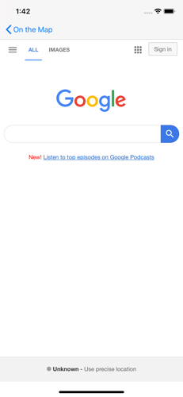
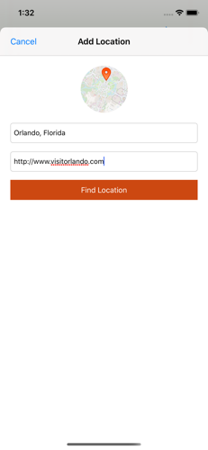
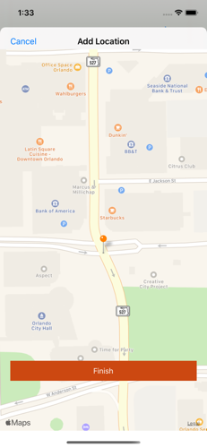

# On The Map

### Project Overview (via Udacity)

Students will create an app with a map that shows information posted by other students. The map will contain pins that show the location where other students have reported studying. By tapping on the pin users can see a URL for something the student finds interesting. The user will be able to add their own data by posting a string that can be geocoded to a location, and a URL.

### Usage

Logging in requires a udacity account with email/password. A signup link is provided on the app home screen.

### Images

The login screen of the app makes a POST request with the username/password to get a session ID.

The MapView shows locations of other students that have been posted. The List tab shows a table view of students with their locations. Selecting an annotation or tableview cell launches the supplied link. The Logout function uses a DELETE request to end the session.

 

Users are able to add their own location using a PUT request. The app uses CLGeocoder to confirm the input location.

  